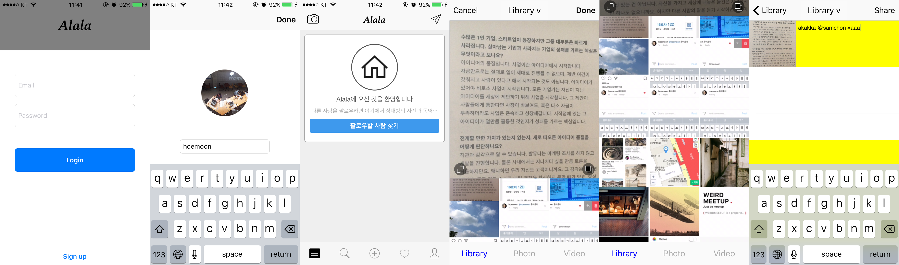
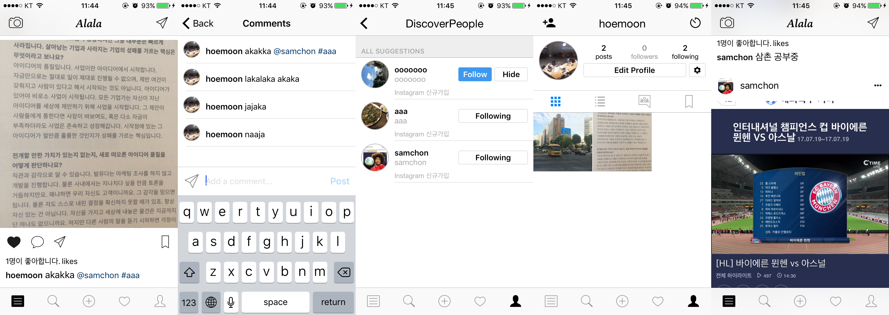

# Alala Client
> 인스타그램 따라잡기

### 현재 진행 상황
[demo](https://youtu.be/0NQ4ubl6Slo) on youtube



## 개발 환경 설정
서버는 node.js, 데이터베이스는 mongodb 사용. [저장소](https://github.com/team-meteor/Alala-Server)
```
make bootstrap
```
