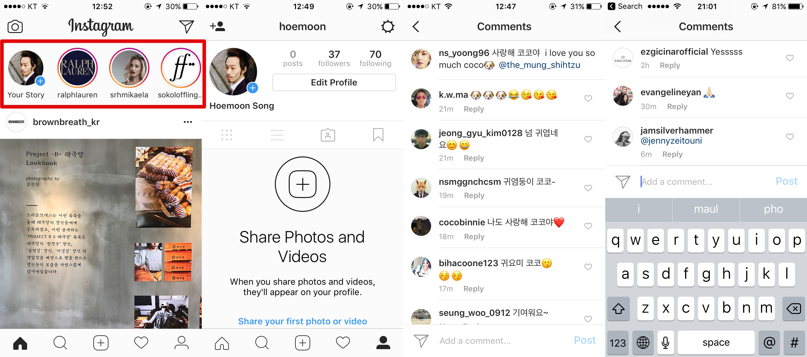

# Alala Client
> 인스타그램 따라잡기

### 주요 화면



## 따라잡을 주요 기능
- email로 회원가입 할 수 있다.
- 가입할 때 다른 user를 follow할 수 있다.

### feed
- follow한 user의 post만 feed에서 볼 수 있다.
- post에는 작성한 user의 profilePhoto, username을 가장 위에 보여줘야 한다.
- feed의 post comment 버튼을 누를 수 있고, 누르면 comment 리스트를 보여주고, comment 를 작성할 수 있다.
- feed의 post heart 버튼을 누를 수 있고, 누르면 likeCount가 증가해야 한다.
- profilePhoto나 username을 누르면 user profile page로 이동한다.

### profile page
- profile page에는 profilePhoto, post 갯수, follower 수, following 수가 표시된다.
- follow 버튼이 있고, 상태를 갱신해서 보여준다.
- post를 tile 또는 card 형태로 볼 수 있다.

### create
- Photos 적용하여 사용자의 PhotoLibrary 접근
- collectionView에 IGListKit 적용
- containerView에 multiple ViewController 삽입
- AVFoundation 적용하여 photo, video Capture
- 사진, 비디오, description 을 posting

### comment


## 따라잡을 부가 기능
- facebook으로 회원가입 할 수 있다.
- `...` 버튼을 누르면 공유 관련 메뉴가 뜬다.
- feed의 post send 버튼을 누를 수 있고, 누르면 user를 선택할 수 있는 view가 올라오고, user를 선택할 수 있다.
- user를 선택하면 post를 공유할 수 있다. user의 message 뷰에서 확인할 수 있다. 알림이 발생한다.
- post save 기능


Feed, Discover, Create, Heart, Profile

## 개발 환경 설정
서버는 node.js, 데이터베이스는 mongodb 사용. [저장소](https://github.com/team-meteor/Alala-Server)  
```
brew install carthage
carthage update --platform iOS
```

